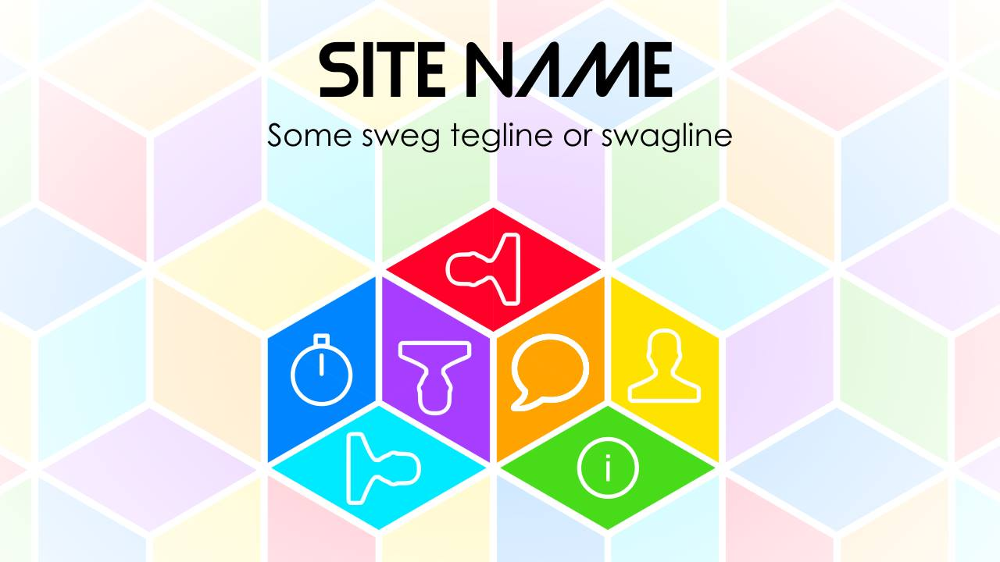
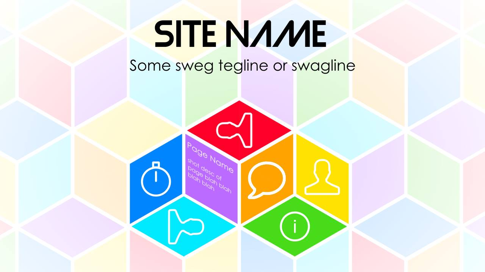
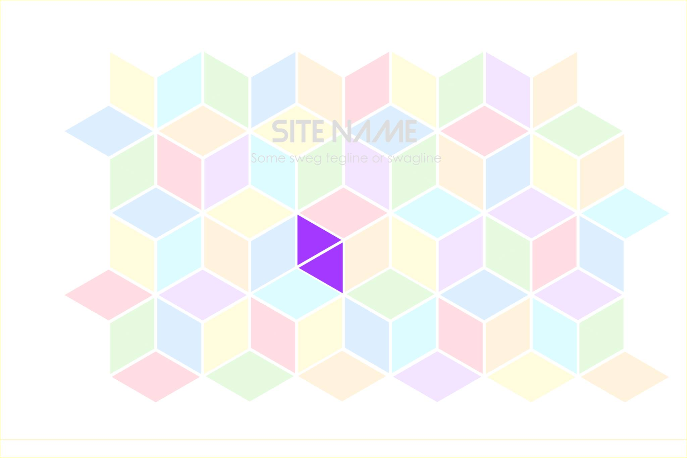
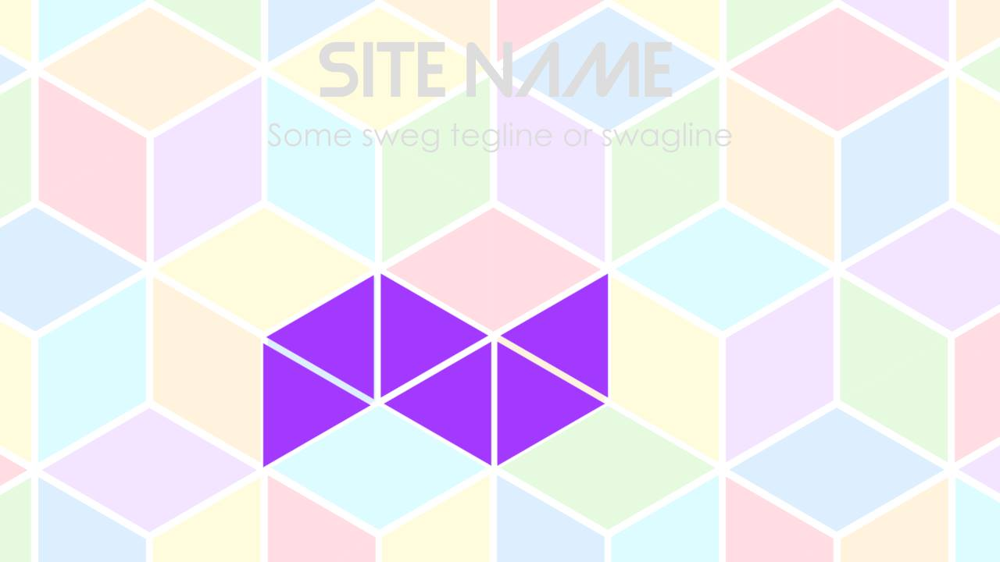

#Design Document 

###SiteMap
1. [Home](#home-desc)
  * Upcoming Competition (link to [3](#upcoming comps) with summary)
  * Blog (summary of latest feed)
  * I am new (link to [5](#org-guide) and [6](#comp-guide))
2. About
  * The team ❤
  * Time-line 
  * Our mission and vision
  * Contact
3. Comps
  *<a name="upcoming comps"> Upcoming Competitions </a>
  * Past Competitions
4. Blog
5. <a name="org-guide"> Organizers Guide </a>
6. <a name="comp-guide"> Competitiors Guide </a>
7. Organize a Competition with Us
  * Terms and conditions
8. Timer
  * Spoof CsTimer (not)
9. Donate (yay thug lyf)

###<a name="home-desc">1. Home</a>
The proposed design of Home page looks as below

On mouse hover, it changes icons to text description

On mouse click, it splits in a sequence.

